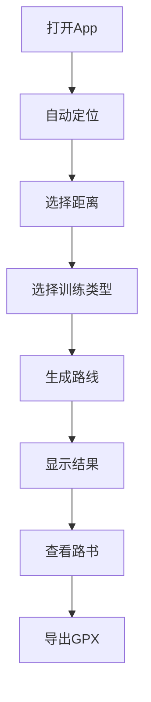

## 1. 产品概述
NoStop是一款专为城市公路车骑行者设计的智能路书生成应用，解决绕圈训练中频繁停车、路线不连贯的痛点。通过AI算法生成红绿灯少、无掉头弯的闭环路线，让骑行节奏更流畅。

目标用户：城市公路车骑行爱好者，特别是进行绕圈训练的用户。核心价值：提供可解释、可重复的高质量训练路线。

## 2. 核心功能

### 2.1 用户角色
| 角色 | 注册方式 | 核心权限 |
|------|----------|----------|
| 普通用户 | 手机号注册 | 生成路线、查看路书、导出GPX |
| 匿名用户 | 无需注册 | 基础路线生成（限制次数） |

### 2.2 功能模块
NoStop MVP包含以下核心页面：
1. **首页/生成页**：位置定位、距离选择、训练类型
2. **路线结果页**：地图展示、路线评分、路书说明
3. **导出页面**：GPX文件导出、路线保存

### 2.3 页面详情
| 页面名称 | 模块名称 | 功能描述 |
|----------|----------|----------|
| 首页/生成页 | 位置定位 | 自动获取用户当前位置，显示定位精度 |
| 首页/生成页 | 距离选择 | 提供10/20/30/40km快捷按钮，支持自定义输入 |
| 首页/生成页 | 训练类型 | 默认绕圈训练，显示训练目标说明 |
| 首页/生成页 | 生成按钮 | 一键生成路线，显示生成进度 |
| 路线结果页 | 地图展示 | 显示推荐路线，标注红绿灯位置 |
| 路线结果页 | 路线评分 | 显示评分结果，包括红绿灯数、掉头弯等关键指标 |
| 路线结果页 | 路书说明 | AI生成的路线描述，包含训练建议和注意事项 |
| 路线结果页 | 路线切换 | 支持查看多条候选路线 |
| 导出页面 | GPX导出 | 一键导出标准GPX格式文件 |
| 导出页面 | 路线保存 | 保存路线到本地，支持命名管理 |

## 3. 核心流程
用户打开App后，系统自动定位当前位置。用户选择目标距离（10/20/30/40km）和训练类型，点击生成按钮。系统在10秒内生成3-5条候选路线，按评分排序展示。用户可查看路线详情、路书说明，选择最佳路线后导出GPX文件。

## 4. 用户界面设计

### 4.1 设计风格
- **主色调**：深绿色（#2E7D32）代表骑行环保，橙色（#FF6B35）作为强调色
- **按钮样式**：圆角矩形，主要操作为实心按钮，次要操作为边框按钮
- **字体**：思源黑体，标题18px，正文14px，说明文字12px
- **布局风格**：卡片式布局，信息层级清晰，操作区域突出
- **图标风格**：线性图标，简洁易懂，符合骑行主题

### 4.2 页面设计概述
| 页面名称 | 模块名称 | UI元素 |
|----------|----------|--------|
| 首页 | 距离选择 | 四个圆形按钮呈2x2排列，选中状态为实心橙色，未选中为边框灰色 |
| 首页 | 生成按钮 | 底部全宽按钮，绿色背景，白色文字，包含生成图标 |
| 结果页 | 地图区域 | 占屏幕60%空间，路线用橙色粗线标注，红绿灯用红色圆点标记 |
| 结果页 | 评分卡片 | 横向排列四个评分指标，每个指标包含图标、数值和文字说明 |
| 结果页 | 路书卡片 | 白色圆角卡片，包含路线描述、训练建议、注意事项三个段落 |

### 4.3 响应式设计
采用移动优先设计，主要适配手机屏幕（375px-414px宽度）。平板和桌面端保持核心功能不变，适当扩展地图显示区域。触摸交互优化，按钮点击区域不小于44px，支持滑动手势切换路线。