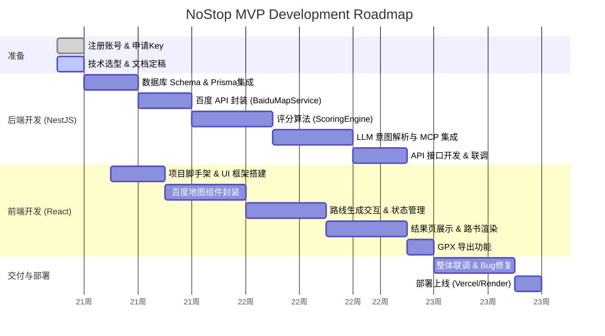

# NoStop (不停车) - MVP 开发计划与甘特图

## 1. 准备工作 (Pre-requisites)

在正式写代码前，需要完成以下账号注册与 Key 获取：

- [x] **百度地图开放平台**: 注册开发者，创建应用，申请 **Web 服务 Key** (用于后端 API) 和 **Web 端 (JS API) Key** (用于前端地图展示)。
- [x] **Supabase**: 创建新项目 `nostop-db`，获取 `DATABASE_URL` 和 `SUPABASE_KEY`。
- [x] **MiniMax**: 注册 [MiniMax 开放平台](https://platform.minimax.io/)，获取 API Key (模型选用 `MiniMax-M2`)。

## 2. 阶段规划 (Phases)

### Phase 1: 基础设施与原型 (Week 1)

- **目标**: 跑通前后端连接，数据库就绪，能调用百度地图 API。
- **任务**:
  - 初始化 Supabase 数据库表结构 (User, Route)。
  - NestJS 集成 Prisma 连接数据库。
  - 后端封装 `BaiduMapService`，实现调用百度“骑行路径规划”接口。
  - 实现基础评分算法 `ScoringService` (红绿灯统计)。

### Phase 2: 核心业务逻辑 (Week 2)

- **目标**: 实现“生成 -> 评分 -> 筛选”完整链路，支持多路线生成与多源数据融合。
- **任务**:
  - **API升级**: 升级 `BaiduMapService`，支持生成 3 条不同方向的闭环路线。
  - **数据融合**: 调用汽车导航 API 获取实时路况（拥堵状态）和红绿灯数据，并融合到 `ScoringService`。
  - **前端重构**:
      - 首页：实现自动定位、修改起点交互（无终点）、分离模式选择与生成触发。
      - 结果页：支持多条候选路线的切换与展示。
  - 完善评分算法：增加转弯角度分析 (识别掉头弯) 和连续路段计算。
  - 定义 `RouteDTO` 和 API 接口 (`POST /generate`)。
  - 后端接口联调测试 (Postman/Curl)。

### Phase 3: 前端开发与可视化 (Week 2-3)

- **目标**: 用户能在地图上看到路线，并进行交互。
- **任务**:
  - 前端接入百度地图 JS API，封装 `MapComponent`。
  - 实现首页输入表单 (位置、距离)。
  - 对接后端生成接口，在地图上绘制 GeoJSON 路线。
  - 展示核心指标卡片 (红绿灯数、评分)。

### Phase 4: 优化与交付 (Week 4)

- **目标**: 提升体验，修复 Bug，部署上线。
- **任务**:
  - 集成 LLM 生成自然语言路书点评。
  - 实现 GPX 导出功能。
  - UI/UX 细节打磨 (Loading 状态、错误处理)。
  - 部署前端到 Vercel，后端到 Render/Zeabur。

## 3. 开发甘特图 (Gantt Chart)

## 4. 立即执行的下一步 (Next Actions)

1.  **数据库初始化**: 在 `packages/shared` 或后端目录创建 `prisma/schema.prisma`。
2.  **安装依赖**: 为 `apps/api` 安装 `prisma` 和 `@nestjs/config`。
3.  **百度地图接入**: 在后端创建一个简单的 Service，尝试 curl 百度骑行路径接口，验证 Key 是否有效。
