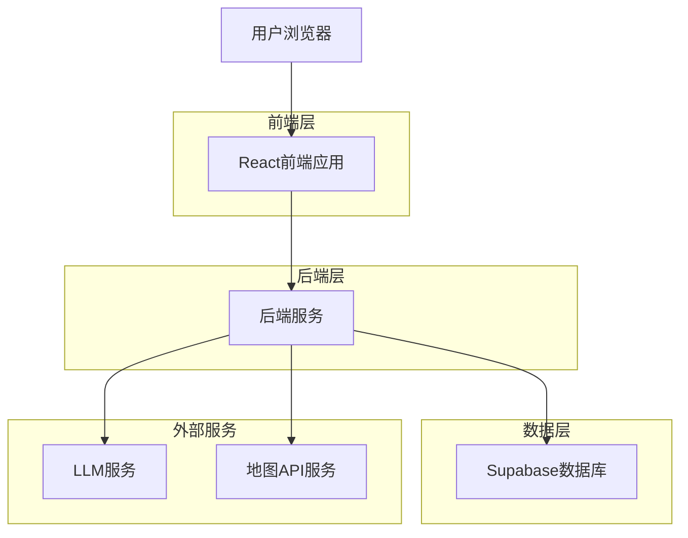
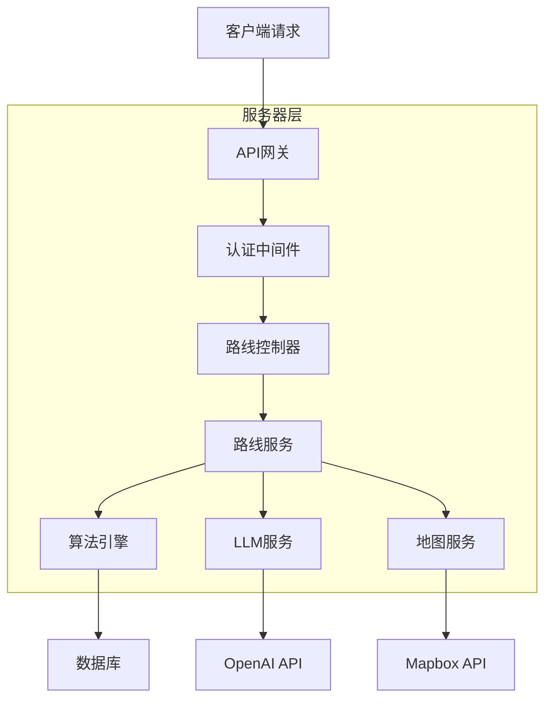
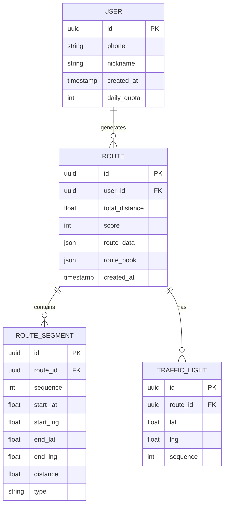

## 1. 架构设计



## 2. 技术栈描述

- **前端**: React@18 + TypeScript@5 + TailwindCSS@3 + Vite
- **初始化工具**: vite-init
- **后端**: Node.js@20 + Express@4
- **数据库**: Supabase (PostgreSQL)
- **地图服务**: Mapbox GL JS
- **LLM服务**: OpenAI GPT-3.5-turbo

## 3. 路由定义

| 路由 | 用途 |
|------|------|
| / | 首页，路线生成界面 |
| /route/:id | 路线详情页，显示地图和路书 |
| /export | 导出页面，GPX文件下载 |
| /profile | 用户个人中心（可选） |

## 4. API定义

### 4.1 路线生成API
```
POST /api/route/generate
```

请求参数：
| 参数名 | 类型 | 必需 | 描述 |
|--------|------|------|------|
| lat | number | true | 起始纬度 |
| lng | number | true | 起始经度 |
| distance | number | true | 目标距离(km) |
| type | string | true | 训练类型(loop) |

响应：
| 参数名 | 类型 | 描述 |
|--------|------|------|
| routes | array | 路线候选列表 |
| status | string | 处理状态 |

示例：
```json
{
  "lat": 31.2304,
  "lng": 121.4737,
  "distance": 30,
  "type": "loop"
}
```

### 4.2 路线评分API
```
POST /api/route/score
```

请求参数：
| 参数名 | 类型 | 必需 | 描述 |
|--------|------|------|------|
| route | object | true | 路线GeoJSON数据 |

### 4.3 路书生成API
```
POST /api/route/book
```

请求参数：
| 参数名 | 类型 | 必需 | 描述 |
|--------|------|------|------|
| route | object | true | 路线数据和评分结果 |

## 5. 服务器架构



## 6. 数据模型

### 6.1 实体关系图


### 6.2 数据定义语言

用户表(users)
```sql
CREATE TABLE users (
    id UUID PRIMARY KEY DEFAULT gen_random_uuid(),
    phone VARCHAR(20) UNIQUE NOT NULL,
    nickname VARCHAR(50) DEFAULT '骑行者',
    daily_quota INTEGER DEFAULT 5,
    created_at TIMESTAMP WITH TIME ZONE DEFAULT NOW(),
    updated_at TIMESTAMP WITH TIME ZONE DEFAULT NOW()
);

-- 创建索引
CREATE INDEX idx_users_phone ON users(phone);
CREATE INDEX idx_users_created_at ON users(created_at DESC);
```

路线表(routes)
```sql
CREATE TABLE routes (
    id UUID PRIMARY KEY DEFAULT gen_random_uuid(),
    user_id UUID REFERENCES users(id),
    total_distance FLOAT NOT NULL,
    score INTEGER NOT NULL CHECK (score >= 0 AND score <= 100),
    route_data JSONB NOT NULL,
    route_book JSONB NOT NULL,
    created_at TIMESTAMP WITH TIME ZONE DEFAULT NOW(),
    updated_at TIMESTAMP WITH TIME ZONE DEFAULT NOW()
);

-- 创建索引
CREATE INDEX idx_routes_user_id ON routes(user_id);
CREATE INDEX idx_routes_score ON routes(score DESC);
CREATE INDEX idx_routes_created_at ON routes(created_at DESC);
```

路段表(route_segments)
```sql
CREATE TABLE route_segments (
    id UUID PRIMARY KEY DEFAULT gen_random_uuid(),
    route_id UUID REFERENCES routes(id) ON DELETE CASCADE,
    sequence INTEGER NOT NULL,
    start_lat FLOAT NOT NULL,
    start_lng FLOAT NOT NULL,
    end_lat FLOAT NOT NULL,
    end_lng FLOAT NOT NULL,
    distance FLOAT NOT NULL,
    type VARCHAR(20) DEFAULT 'normal'
);

-- 创建索引
CREATE INDEX idx_segments_route_id ON route_segments(route_id);
CREATE INDEX idx_segments_sequence ON route_segments(sequence);
```

红绿灯表(traffic_lights)
```sql
CREATE TABLE traffic_lights (
    id UUID PRIMARY KEY DEFAULT gen_random_uuid(),
    route_id UUID REFERENCES routes(id) ON DELETE CASCADE,
    lat FLOAT NOT NULL,
    lng FLOAT NOT NULL,
    sequence INTEGER NOT NULL
);

-- 创建索引
CREATE INDEX idx_lights_route_id ON traffic_lights(route_id);
CREATE INDEX idx_lights_sequence ON traffic_lights(sequence);
```

### 6.3 权限设置
```sql
-- 匿名用户权限
GRANT SELECT ON routes TO anon;
GRANT SELECT ON route_segments TO anon;
GRANT SELECT ON traffic_lights TO anon;

-- 认证用户权限
GRANT ALL PRIVILEGES ON routes TO authenticated;
GRANT ALL PRIVILEGES ON route_segments TO authenticated;
GRANT ALL PRIVILEGES ON traffic_lights TO authenticated;
GRANT ALL PRIVILEGES ON users TO authenticated;
```